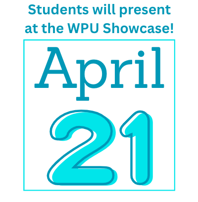

--- 
title: "Course Overview"
author_profile: true
permalink: /about/
---

Download a copy of the [syllabus](../bio231-syllabus.pdf)

This semester, students will evaluate the quality of local water ways using data analysis of large water quality data sets and physical, chemical, and invertebrate assessments in the field. 

At the end of the semester, students can expect to be able to:

1. Analyze data using R programming, including importing and manipulating data, calculating simple statistical measurements, and producing graphs. 
1. Evaluate water quality using field and lab tests. 
1. Communicate original research findings to a variety of audiences. 

### Course Topic

Water is an extremely valuable resource, providing countless ecosystem services, from drinking water, wildlife habitat, flood control, recreation, and many more. As humans, we rely on these services but also negatively affect our waterways. Humans pollute water sources, physically alter stream paths, and degrade steam ecosystems. In this course, students will appreciate the value of our water resources, evaluate the quality of streams in Raleigh, and understand the ways that human activities in Raleigh are shaping our water systems. 

### Data collection and analysis

In Environmental Topics and Analysis, students will evaluate water quality in Raleigh through data analysis of a long term data set and through field measurements. 

#### Data analysis

Students will learn the programming language R to analysis the water quality data of 18 different streams in Raleigh using data collected by the City of Raleigh from 2008 - 2023. Data analysis in R is a valuable and marketable skill that can be used in your future careers in and out of science! Students will summarizing data, presenting data in tables and figures, and statistically analyze data in R. 

#### Field collection

In addition to analyzing data sets, students will also go into the field to measure water quality of a stream near to campus. Students will learn real-world methodologies for measuring the physical, chemical, and biological metrics for evaluating water quality. 

### Scientific Presentations

In addition to data analysis, this class will focus heavily on scientific reading and writing. What is the point of collecting and analyzing data if we don't share it?! Students will practice reading primary scientific literature and governmental reports to understand ongoing research in stream ecology, create engaging figures and presentations for broad audiences, and report scientific findings to the scientific community. 

Students will present water quality results at the WPU Showcase on Tuesday April 21!
