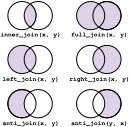

```{r klippy, echo=FALSE, include=TRUE}
klippy::klippy()
```

You can use this [template script](./advancedR_script.R) file to work through the lesson. 

## Joins

Sometimes, it is useful to work with multiple datasets to evaluate a question. Maybe, you completed an experiment two different times and want to put the two together. Or maybe you want to add in other information about the conditions or environment. It can be helpful to **join** the datasets into one. 

You can do this using dplyr "join" functions. There are a few different join functions based on what rows to include from the two data sets. For example, you can keep every row from both data sets (full_join), only rows that are in both (inner_join), or all rows from one (left_join or right_join) 



When doing a join, you must give at least one column to know how to match the two data sets. Here, we will work on an example using some sample data. Let's imagine that we are interested in the relationship between growth rates and photosynthesis in plants. First, we measure the growth of 10 plants over the course of a couple months, and record this data in a spreadsheet. Then, we go back and measure the photosynthesis, as the amount of carbon dioxide that the plants take in, a couple weeks later. Unfortunately, some of the plants either died and we were unable to measure the photosythesis for all the plants. We record this data in a different spreadsheet. 

First, we will load in our two data files as `growth` and `co2`. 

```{r}
growth <- read.csv('https://maryglover.github.io/bio331/open_data/growth.csv')

photosynthesis <- read.csv('https://maryglover.github.io/bio331/open_data/photosynthesis.csv')
```

We can look at these two data files. 

```{r}
growth
photosynthesis
```

To look at the growth and the photosynthesis rates together, we need to **join** these two files. Here, we will start with the growth data set and then do an `inner_join` to just keep the rows were the plants are present in *both* data sets. In this case, we want the *match* the data by the Plant_ID column. You can see that the `join` function does not just add a new column, but add in the CO2 value, based on the Plant_ID value. So the Plant_IDs do not have to be in the same order in the two two data frames.

```{r, message=F}
library(dplyr)
growth |>
  inner_join(photosynthesis, by = 'Plant_ID')
```

Notice: because this is the first time we have used a dplyr function, we first loaded in the package. 

Often, the join function can determine what to match the data frames by, as long as the columns have *exactly* the same name. So you will get the same answer if you leave out the `by=` argument. 

```{r}
growth |>
  inner_join(photosynthesis)
```

Now see what happens when you do a `full_join` instead. 

```{r}
growth |>
  full_join(photosynthesis)
```

You can see here, that all the Plant_IDs are present in the joined data set. When there is no match in the photosynthesis data frame for a plant, the `CO2` is indicated as "NA".


<span style="color:blue">**Activity:**</span>

- On your own, try a `right_join` and a `left_join`. What do you notice about the difference?

```{r, echo = F, eval = F}
growth |>
  right_join(photosynthesis)
growth |>
  left_join(photosynthesis)
```

Right and left joins will keep all the rows in either the right or the left join, respectively. Think back to what the pipe, `|>` is doing. 

This code

```{r, eval = F}
growth |>
  right_join(photosynthesis)
```  

is the same as:

```{r, eval = F}
right_join(growth, photosynthesis)
```

In this case, the photosynthesis data is on the *right* of the two, so all the Plant_IDs present in the photosynthesis data will remain in the joined data, but not the rows only present in the growth data. A `left_join` would keep all the Plant_ID values in the growth data frame, even if they are not in the photosynthesis data. 

Remember, when we use `dplyr` functions, the changes we make are not saved unless we assign the output to a new data frame. Let's say we wanted to graph the relationship between the growth and photosynthesis. We would need to reassign the joined data to a new data frame and then graph it. 

```{r, echo = F, message = F, warning = F, fig.show=F}
plant <- growth |>
  full_join(photosynthesis)

library(ggplot2)
ggplot(plant, aes(x = CO2, y = Growth_in)) +
  geom_point() +
  theme_classic()
```


## Aquatic macroinvertebrate example

In this example, we will combine what we learned in our last lesson on summary tables with joins. We will use data collected by this class in 2024 for the macroinvertebrate insects they found during a class period in a nearby stream. 

First, we will read in the data from our class website. I will call it `invert`

```{r}
invert <- read.csv('https://maryglover.github.io/bio331/open_data/macroinvertebrate_sampling.csv')
```

Let's again start by just looking at the data

```{r}
head(invert)
```

### Summarizing the data 

In this data, we have the different taxa that two different student groups collected and how many of each they collected. 

Let's look at the *species richness* or how many *different* taxa were collected. Here, we want to *tally* the individual taxa in *each* group. We can do this again with the `n()`function. 

```{r}
invert |>
  group_by(Group)|>
  summarize(richness = n())
```

Let's say we want to know how many total insects *each* group collected to see if one group collected more than the other. Go ahead and try this summary on your own. You should get the following answer. 

```{r, echo = F}
invert |>
  group_by(Group) |>
  summarize(total = sum(N))
```

Now, let's see how many total insects we collected from each taxa. This gives us the *abundance* of each different invertebrate. **Notice:** We are only changing the grouping that we are using. First, we wanted to see how many insects each group collected. Now we want to see how many insects in each taxa. So you *only* need to change one variable from the previous code. 

```{r}
invert |>
  group_by(Taxa)|>
  summarize(total = sum(N))
```

### Graphing the data

One thing you can do with this data is make a bar graph to show the different insects that were collected in the stream. 

First, we want to save the data table we made. Remember, as with other `dplyr` functions, the functions do *not* change the underlying data. 

```{r}
invert_summary <- invert |>
  group_by(Taxa)|>
  summarize(total = sum(N))
```

Then, we can use `ggplot` to plot the data with the layer `geom_bar`.

```{r, message = F}
library(ggplot2)
```

```{r, eval =F}
ggplot(invert_summary, aes(x = Taxa, y = total))+
  geom_bar()
```

You will notice that this code does *not* work. `geom_bar` requires an additional argument that indicates how to determine the bar height. We just want the bar height to be the value in the total column. To do this we must set `stat = "identity"`

```{r}
ggplot(invert_summary, aes(x = Taxa, y = total))+
  geom_bar(stat = 'identity')
```
You will notice that this is hard to read with the axis labels. We can fix this in two ways:

- rotate the axis labels
- plot horizontally 

To rotate the axis labels, you must adjust the angle of the `axis.text.x` in a `theme()` layer like so:

```{r}
ggplot(invert_summary, aes(x = Taxa, y = total))+
  geom_bar(stat = 'identity')+
  theme(axis.text.x = element_text(angle = 90))
```

Alternatively, we can just switch the x and the y to plot in the other direction. 

```{r}
ggplot(invert_summary, aes(y = Taxa, x = total))+
  geom_bar(stat = 'identity')
```

### Joining the data

Macroinvertebrate sampling is often used in streams to measure water quality by looking at how tolerant the taxa are to pollution. If there are many taxa that are intolerant, or cannot live in streams with lots of pollution, that indicates that the stream is relatively healthy. 

Here, we will join in a data file that has the pollution class for different aquatic macroinvertebrates. 

```{r}
pollute_class <- read.csv('https://maryglover.github.io/bio331/open_data/pollution_class.csv')

head(pollute_class)
```

<span style="color:blue">**Activity:**</span>

- Join the two data frames together. Make sure you keep all the Taxa collected in the `invert` data frame. 
- Make a bar graph to show the number of insects collected in each Pollution class.

```{r, echo = F, eval = F}
macro <- invert |>
  full_join(pollute_class) |>
  group_by(Pollution) |>
  summarize(N = sum(N, na.rm = T))

ggplot(macro, aes(x = Pollution, y = N)) +
  geom_bar(stat = 'identity')
```

## Dealing with Dates

Another useful tool in R is learning how to work with dates. Dates can be a complicated data format to work with in R. They are often characterized as "characters", however they do have a quantitative nature and can thus be considered as continuous. We *want* to be able to put things in order of the data to see how things change over time. 

Let's look back at the Raleigh climate.

```{r}
climate <- read.csv('data/raleigh_prism_climate.csv')
head(climate)
```

If we look at the top of this data frame, we can see that we have separate columns for year and month. This can be helpful when looking at the differences in months or years, but with this format, we cannot make a graph to see how the climate variables change over the entire time frame. We want to have a column that has the full date, with month and year. We can do this by utilizing the `lubridate` package. `lubridate` works with `dplyr` functions and includes many functions to work with dates. 

Here, we will use the `make_date` function, to take the year and month columns and turn them in to one date. We will also incorporate the `mutate` function. We will use `mutate` to make a new column using the function `make_date`. The `make_date` function expects a column, for year, month, and day. We do not have a day column, so will just provide year and month. It must be in this order. Since we are using a new package, we will also have to load it in.

```{r}
library(lubridate)
climate |>
  mutate(date = make_date(year, month))|>
  head()
```

Now, you can see a new column `date`, which we created. You will also notice that there is a day. Because we did not provide a column for the day, the default is the first. This is fine for our analysis, but is important to consider if using in the future. If we save this data frame with the date column, we can use it to make a line graph of the `tmean` over the entire data set. 

```{r}
climate_date<- climate |>
  mutate(date = make_date(year, month))

ggplot(climate_date, aes(x = date, y = tmean)) +
  geom_line()
```

### Setting date format

Let's look back at our water quality data. You should have our updated water quality file in your workspace. Go ahead and load that in. 

```{r}
wq <- read.csv('data/raleigh_water_analysis.csv')
```

We can see in this data frame thehat here is a column with the date in the format yyyy-mm-dd. 

```{r}
head(wq)
```

As is, this is just a string of characters -- R does not know that this is a date and should be treated as such. We will need to format it as a date in the data frame. The package `lubridate` does this easily. Lubridate has a variety of functions to make a variable a date based on the order of the date objects in the string, for example dmy(), myd(), ymd(). 

Our date is in the year, month, date format so we can use the function ymd() to turn the Date column into a date class. We will again use `mutate` as we are changing a column. In this case, instead of making a new column, we will resave the Date column. We will also save the `wq` data frame to keep this format change

```{r}
wq<- wq |>
  mutate(Date = ymd(Date)) 

head(wq)
```

You can see the data itself didn't change, but under Date, the type of data has changed. 

<span style="color:blue">**Activity:**

Now that we have the date in the correct format, we can plot it like we did the climate. 
 
1. Pick one stream and filter the data with that stream.
1. Make a line graph with Date on the x-axis. Choose one of the other stream variables on the y axis

</span>

```{r, include = F, echo =F, fig.show=F}
phb <- wq|> 
  filter(Site == 'PHB12')
ggplot(phb, aes(x=Date, y = Copper_mg_L)) +
  geom_line()
```

### Extracting date variables

Changing the date format is very useful when looking at the data over time. We can also use other lubridate functions to extract out the date components like month(), year(), wday(). This will get only the specific date variable (day, month, year) from the date. For example, let's say we want to look at the difference in different years. We don't want the entire date, we want to make a group for the year. We can extract the year using the function `year` and use `mutate` to make a new column.  get a column for the year.

```{r}
wq |>
  mutate(year = year(Date))|>
  head()
```

Now that we know how to get a column for the year, we can use what we have learned about summary tables, to summarize based on the year. Let's look to see turbidity and total nitrogen for the different years. 

```{r}
wq |>
  mutate(year = year(Date)) |>
  group_by(year)|>
  summarize(turbidity = mean(Turbidity_NTU, na.rm =T), nitrogen = mean(Nitrogen_total_mg_L, na.rm = T))
```

## Join water quality data

In the lessons with water quality data, we have often summarized based on the different stream. The data uses a steam code. However, it would be useful to have the full stream name for our evaluation. 

Here, we have a file that matches the code to the stream name and gps coordinates.

```{r}
stream_codes <- read.csv('https://maryglover.github.io/bio331/open_data/stream_codes.csv')

head(stream_codes)
```

Use what you learned to join with the stream codes to your full water quality data set. 

You should get something that looks like this:

```{r, include= T, echo = F}
right_join(stream_codes, wq) |> head()
```

## Exercises

### Part 1: NC Monitoring Data

The North Carolina Department of Environmental Quality also collects data on streams in Raleigh. In this homework assignment, you will use what you learned about working with dates to look at a separate dataset on water in Raleigh. 

1. Import the data from our class website using the following code: 
```{r}
nc_monitor <- read.csv('https://maryglover.github.io/bio331/open_data/NC_monitoring.csv')
```
2. Convert the `Date` columns to the date format using what you learned from the lubridate function `ymd()`
1. Filter the date to only include the Location "Pigeon_House" and assign the data frame a new name.
1. Using the data from the Pigeon_House location that you just made, make a line graph to show how the Fecal.Coliform changes over time. 
1. Add a theme to your plot and change the color of the line
1. Now, make a summary table using the Pigeon House data to get the mean Fecal.Coliform for each year:
   1. Extract the year data and make a new column
   1. Make a summary table. group by the year column
   1. Summarize to get the mean of the Fecal.Coliform column. You will need to specify that `na.rm =T`.

```{r, include =F, echo = F}
nc_monitor <- nc_monitor |>
  mutate(Date = ymd(Date))
pigeon <- nc_monitor |>
  filter(Location == 'Pigeon_House')
ggplot(pigeon, aes(x= Date, y = Fecal.Coliform)) +
  geom_line(color = 'darkgreen') +
  theme_classic()

pigeon |>
  mutate(year = year(Date)) |>
  group_by(year) |>
  summarize(FC = mean(Fecal.Coliform, na.rm = T))
```

### Part 2: Water quality and precipitation

The water quality data set includes many water quality metrics. However, you may want to add in other data to use with the water quality data in your analysis. For example, one question the City of Raleigh has is how the precipitation might affect the values collected. To answer this question, you have to "join" two data sets. 

1. Import this data set that includes precipitation for each of the dates and sites sampled.
```{r}
stream_precip <- read.csv('https://maryglover.github.io/bio331/open_data/precip_stream_sites.csv')
```
1. Change the date column in the stream_precip data so that it is in the data format. You should have already done this with your water quality data. If you have not, make the date column in your water quality data in the date format as well. You will use the `ymd()` function.
1. Join the water quality data with this precipitation data. Make sure you assign a new name to your joined data. 
1. Make a scatterplot that shows the relationship between `Turbidity_NTU` and `precip` using your joined data set. 
1. Do you notice anything about the relationship?
```{r, include=F, echo =F}
joined <- stream_precip |>
  mutate(Date = ymd(Date))|>
  right_join(wq) 
 
ggplot(joined, aes(x= precip, y = Turbidity_NTU)) +
  geom_point()
```

### Part 3: Season summary

1. Use the joined data that you used for the Part 2 on water quality. 
1. Add a column to the data that includes only the month that the sample was created. See the section on Extracting date variables in the [lesson](### Extracting date variables)
1. Make a summary table that calculates the mean of the `do_percent_sat` and the mean of the `Temperature_C` columns for each month.
1. Is the result what you expected?
```{r, include = F, echo =F}
joined |>
  mutate(month = month(Date))|>
  group_by(month) |>
  summarize(do = mean(do_percent_sat, na.rm = T), temp = mean(Temperature_C, na.rm = T))
```

## List of new functions

- lubridate functions
    - `make_date()`
    - `ymd()`
- join functions
    - `inner_join`
    - `full_join`
- `geom_bar()`

## Resources

- [R for Data Science](https://r4ds.hadley.nz/transform)
- more about [dplyr joins](https://www.tidyverse.org/blog/2023/01/dplyr-1-1-0-joins/)
- [Lubridate cheat sheet](https://rawgit.com/rstudio/cheatsheets/main/lubridate.pdf)

