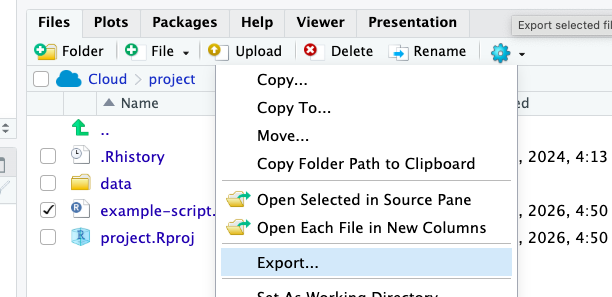

```{r klippy, echo=FALSE, include=TRUE}
klippy::klippy()
```

## Learning objectives

**By the end of this lesson, you should be able to:**

- Navigate Rstudio
- Run code from console and an R notebook
- Perform mathematical operations in R
- Assign variables
- Describe different data types
- Use functions
- Import data into R

This semester, we will be using R to perform data manipulation, analysis, and visualization

## Introduction

### What is R?

R is a free, open source computing *software* used for statistical analysis and graphing. R is also a computing *language*. This means that R software interprets the R language, which is a specific set of vocabulary, formatting, and structure, to perform specific tasks. Other coding languages are Java, C++, python, etc.

### What is Rstudio?

Rstudio is an interface that runs the R software in a user friendly format. Rstudio allows the user to run R code, take notes, view graphs, and view files in one window.

In this course, we will be using Rstudio through the [Posit Cloud website](https://posit.cloud/). This is a browser based way to use Rstudio. This allows you to access your R projects on any computer. This will be convenient for this class because you are able to work on projects in class and then go home and access your work on your on computer by logging in to your account. 

You should already have a posit cloud account and should have received an email with a link to our class workspace. Follow the email link and log in using your posit cloud account. 

In Rstudio, you can set up an *R project* which is a folder on your computer. In Posit Cloud, all work is organized in projects. A project is basically a folder where all your work is contained, including data files, notes, etc. 

We will learn how to make a project in Posit Cloud later. For now, open the **Learn R** project. You will complete the first few lessons here.  

When you open the project, you should see three main panes. 

- The *console* is where the R code is run
- The *environment* shows you variables that have been created in R. You can also click to see history or code run in this pane. 
- The *viewer* has tabs to display plots, files on your computer, and help documentation.


## Using R

The next few sections will go through common tasks performed in R, which are needed to complete analyses.

### Mathematical calculations

R can perform basic mathematical calculations. To compute a calculations, simply type it in the *Console*. You can do addition (+), subtraction (-), multiplication (\*), division (/), power (\^), to name a few. You can also use parentheses as usual in mathematical equations.

For example for 5 times 2:

```{r}
5 * 2
```

<span style="color:blue">**On your own**</span>, try some mathematical calculations in the Console.

### Using a R script

While you can run code in the console, it is a much better practice to create an R script. This allows you to save your scripts so that you know what you did in an analysis and makes your science *reproducible*. In the script, you can take notes, write code, and run code all from the same file. You can also save the file and re-run or go back and edit later.

Open up a new script by going to File --> New File --> R script. A script file will open above the console. 


**All of your code should be typed in the script.** To run the code from the notebook, but your cursor on the line that you want to run. Then click "Ctrl + enter" on a Windows or Linux machine or 'Cmd + enter' on a Mac.

To add notes, add a '\#' to the beginning of a line. This line will *not* be run in R. For example:

```{r}
# I am doing math
5 * 10
```

<span style="color:blue">**On your own**</span>, try out some math in a script. Add some notes as well. 

### Functions in R

Most tasks in R will be accomplished using **functions**. Functions is code that is stored in R and will run a specific task.

Functions are run using the function name followed by the "arguments." A function can have any number of arguments.

{width="50%"}

Functions can range from very simple to very complex. Many functions exist in R without doing anything, you can "load" additional functions through "packages", or you can even make your own functions.

For example, `log` is a function that will take the natural log of the value given an argument, x.

```{r}
log(x = 1.5)
```

The `log` function can also take an addition argument which sets the base that the logarithms are computed. Two arguments are possible with `log`, x (or the value) and base. So to take the base 10 logarithm of the value 1.5, you could do the following:

```{r}
log(x = 1.5, base = 10)
```

This could be written without the argument names, but you must be very careful to put the arguments in the correct order.

```{r}
log(1.5, 10)
```

Hint: To get help with a specific function, use '?' followed by the function name.

```{r}
?log
```

There are many other mathematical function such as sum, max, min, mean, median, sd (standard deviation). 

### Assigning variables

In R, you can store information (numbers, tables, text, etc.) in variables. To do this, a variable is assigned a name using the characters `<-`. For example, to assign the letter a the value 1.5, type:

```{r}
a <- 1.5
```

Then, when you run `a`, you can see the value.

```{r}
a
```

You can now treat `a` as 1.5. For example, you can take the log of `a`, which is the same as running `log(1.5)`

```{r}
log(a)
```

**Note** R is case sensitive! So be aware of your capitalization. "a" and "A" are not the same!

### Data types

So far, we have only dealt with single numbers, but R can handle numbers or text. With numbers, you can type them in regularly and R will recognize them as such. Text is put into quotations (""). You can use single(') or double (") in R. Without the quotation mark R will try to find a variable of the same name.  

For example, instead of a number, you can store text in a variable:

```{r}
b <- "hello"
```

Then when your run the variable `b`, you get the text as the output.

```{r}
b
```

We can try out using text with the `say` function, giving arguments for the text and the animal. 

```{r}
library(cowsay)
say(b, 'owl')
```

There are other types of data, but numbers (*numeric*) and text (*characters*) are the two main types we will use in this class.

### Vectors

Data can be stored in different data structures including vectors, data frames, and matrices.

**Vectors** are a one dimensional way to put together data of the *same* type (i.e. all text or all characters). The most common way to create a vector is by using the `c()` function, which concatenates, or combines, values into a vector.

Here, a vector with the numbers 5, 10, 20 are made into a vector named "example.vector"

```{r}
example_vector <- c(5, 10, 20)
example_vector
```

**Note** Do *not* use spaces in your names. If you would like to separate words you can use "_" or "-"

You can also perform mathematical calculations or functions with vectors. The function is performed on each entry in the vector

```{r}
example_vector / 5
```

Vectors can also store character data. 

```{r}
rainbow_colors <- c('red', 'orange', 'yellow', 'green', 'blue', 'indigo', 'violet')
rainbow_colors
```

#### Using Functions

You can also run a function with a vector. For example, the function `sum` takes the sum of all numbers. 

```{r}
sum(example_vector)
```

You can also use functions on vectors made with characters. 
For example, here I will use the function `length` to see how long the character vector `rainbow_colors` is. 

```{r}
length(rainbow_colors)
```

### Class Activity: Dice Distributions

In this activity, students will assign data to a vector in R and make a quick graph of the results. <span style="color:blue">**Write all of your code in an R script.**</span>

1. In groups of two, roll the dice a total of 10 times. Record the value. 
1. Create a vector in R with the 10  values. Assign it the name `roll`. 
1. You will now create a histogram of the results using the function `hist`. `hist` takes the argument for a vector of numbers, just like you have in `roll`. 

What do you think of the distribution that you got? Is this expected? 

1. **Repeat** the exercise, but now roll the dice 50 times. How do you think this will change your results?
1. In your script file, write what you notice about the difference in the two graphs. Make sure you "comment" your answer using \# at the start. 

### Save your script

You will want to save your script periodically to save your work. To save your script, go to File and click **save.** 

When you save your script, it will save as a ".R" file in your project. 

**Remember**, it is best *not* to use spaces in your names to help with file management. 

### Data frames

**Data frames** are  data structures with rows and columns, like a table. Each column is essentially a vector, so must have the same data type (i.e. numbers or characters). However, a data frame can consists of columns with different data types. This is widely used for storing data because you can have a column with the treatment name (text) and then a column of the measurement (number).

A data frame might look something like this

```{r, echo=F}
treatment <- c('control', 'control', 'control', 'high N', 'high N', 'high N', 'low N', 'low N', 'low N' )
growth <- c(5, 8, 6, 1, 8, 9, 5, 2,3)
df<- data.frame(treatment, growth)
df
```

A **matrix** is similar to a data frame except that *all data* in a matrix are the same type (i.e. all characters or all numbers).

Data frames most common data structure that you will be working with. For the most part, you will be importing data into R as a data frame from a .csv file. 


#### Reading data files

The main way that you will be adding data to R is using the `read.csv` function. This function takes the file name in quotes as an argument, file. It also has the argument header. This defaults to TRUE. If you have a header you can leave it. If not header should be FALSE. Otherwise the first row of data will be make into the header. Most of the time your data will have a header row.

When you use are reading in data files, R will look for the file in the folder or "directory" you are in. If the file is not in the home folder, you will need to specify where R should look. Folders in names are separated by "/". So, for example the directory "Documents/bio_files/" is a folder "bio_files" inside the folder "Documents." "Documents/bio_files/photosynthesis.pdf" is a PDF file inside the bio_files folder. 

Here, I have a file, "fly_data.csv" in a directory named "data". I can load it in an assign it fly as follows:

```{r}
fly<-read.csv(file = 'data/fly_data.csv', header = TRUE)
```

To check the data, it doesn't always make sense to show the whole data frame, especially if it is very large. I can use the function `head` to only show the first 10 rows. 

```{r}
head(fly)
```

#### Functions and data frames

Now that we have a data frame read into R, we can use functions to explore the data. 

In data frames, you can also specify the column using "$" and the name of the column. This allows you to look at the values in one column. When specify just a single column in the last section, you essentially created a vector. You can also use functions on this vector. 

For example, let's just look at the column for the number of flies, n. 

```{r}
fly$n
```

In the fly data set, we have a column for the species of fly, the location, and the number of flies collected. One thing that we can do is use mathematic functions, such as sum, max, min, mean, median, sd (standard deviation). 

Let's look at the total number (sum) of all the flies collected. 

```{r}
sum(fly$n)
```

We can also use functions of character data. For example, we can use the function `unique` to get every distict value for the species. 

```{r}
unique(fly$species)
```

## Class Activity

Now, we will look at the data file that you created with your data on paper airplanes. 

First, go back to your data. Let's make sure it is in a format that can be analyzed in R. 


### Make an R project

Most of the time in class, we will use R project that are set up for the class. For this activity, let's practice making a new R project so that you know how. 

1. In Posit cloud, to start an R project, click New Project then Rstudio project. 


2. Click at the top to name the project. Here, you will work on your paper airplane example, so name it something accordingly. 

### Data Table Formating

In the last class, you collected data on paper airplanes and input your data table into sheets and saved it as a .csv file. A csv file is a file where each column is separated by commas. It is important to make sure that your table is formatted in a way that R will read it correctly. 

Check your data for these common mistakes:

- Make sure there are no commas in your numbers! Commas indicate to start a new column
- Do not use spaces in your columns. This will make things simpler. You can get rid of spaces or use "_"
- Make sure your numbers are formated as numbers. So instead of "12 inches", you should just have "12". 
- But you do still want to keep track of units! Add to the column header (but remember-- no spaces!)
- Make sure there is not an empty row at the top and that you only have *one* table in the file. 

[**Question**: Look back at your airplane data! Fix any issues and have it checked by Dr. Glover before moving on. ]{style="color:red"}.

### Import data into posit cloud

There is one extra step to reading in data files when using posit cloud. You have to import the data into posit cloud. You can do this in the lower right hand box with the *upload* button. Upload your class file into your R project. **Hint**: when you download from google sheets, it should go to the downloads folder. 


[**Activity**: Download your airplane data from Google Sheets as a .csv file and add to your R project. ]{style="color:red"}.

### Analyze your airplane data

Play around with your airplane data! What can you discover about the data?

**Hint** What is the average distance the airplanes flew? (You can use the `mean` function) The max distance?

## Homework Exercises

**Complete these exercises in the Learning R project**. For the exercises, you should do all of your code in an R script. You can use the one you started in class or create a new one. You will then export the R script and submit in the Moodle assignment. 

### Exercise 1: Vector Data

In this example, you will simulate rolling dice using the `sample` function. This function generates random numbers from a given set of numbers. Let's imagine we roll the dice 100 times. 

1. You will first generate values for one di using `sample(c(1, 2, 3, 4, 5, 6), 100, replace = TRUE)`. This gives 100 values from 1 to 6. `replace = TRUE` means that you can get a number more than once. Make sure you assign the function to a name!
2. Repeat for dice two with a new name. 
3. Add the two vectors togeter to get the total of the two dice. 
4. Create a histogram of the results. 
5. Describe what you notice about the results in your script. 

### Exercise 2: Weather Data

Here, you will use a data set that contains information about climate data in Raleigh. 

1. Use `read.csv` to read the file "raleigh_prism_climate.csv". *It is in the data folder.* 
2. Determine the average mean temperature (tmean column) from  the Raleigh data. 
3. Determine the maximum precipitation that was recorded in Raleigh. 
4. Determine the minimum mean temperature that was recorded in Raleigh. 
5. Make one other calculation of your choosing :)

### Submitting your homework

When you have completed the homework assignment. Export both the R script you used in class for your airplane data and the one you used for the homework. 



Submit the .R files in Moodle. You will *not* be able to preview the files in Moodle, but submit them anyway! I will be able to view them just fine. 

## List of functions used today

- `log`
- `c`
- `sum`
- `length`
- `unique`
- `read.csv`
- `head`
- `sum`
- `max` and `min`

## Resources

- [R for Data Science](https://r4ds.hadley.nz/workflow-basics)
- [Data Science in R: A Gentle Introduction](https://bookdown.org/jgscott/DSGI/getting-started-in-r.html)
- [Rstudio projects](https://support.posit.co/hc/en-us/articles/200526207-Using-RStudio-Projects)


