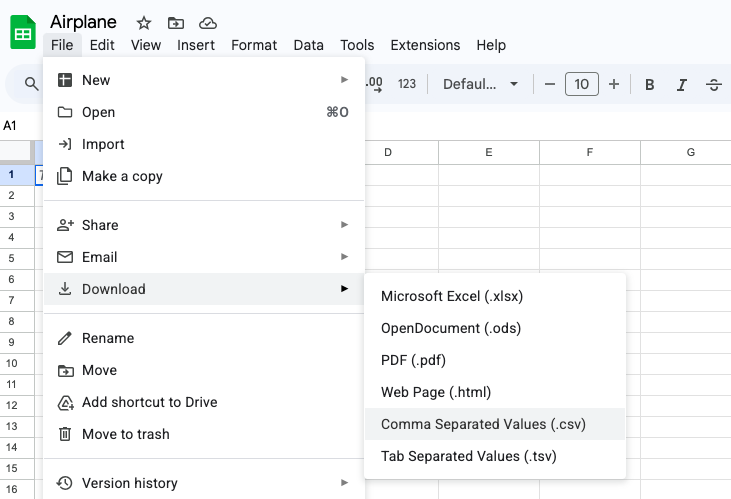

```{r klippy, echo=FALSE, include=TRUE}
klippy::klippy()
```

### **Question**: Which paper airplane is the best flyer?

In this activity, you will design an experiment to test which paper airplane can fly the farthest. 

### Step 1: Experiment design

In your group, determine how you will test which airplane can fly the furthest. In scientific experiments, it is important to be precise and methodical. 

Write out your experimental design. **You must get your design approved by Dr. Glover before moving to the next step**

### Step 2: Data Collection

1. Create a table to record your results. You should have rows and columns :)
1. Conduct your experiment, keeping careful records. 
2. Consider your data table. You will add your data table to a spreadsheet. What do you think of the format? Do you think that you should change the format?
1. Go to google sheets. Add your data to a google sheet spreadsheet. 
1. Save your data as a .csv file by going to File, download, as csv

1. Make sure that everyone in your group has a copy of the .csv file. We will use in the next class!

### Step 3: Graphing

Make a graph of your data. Think about what type of graph is best to highlight your results (ex. bar graph, line graph, dot plot, etc.)

Share your graph and your results with the class!