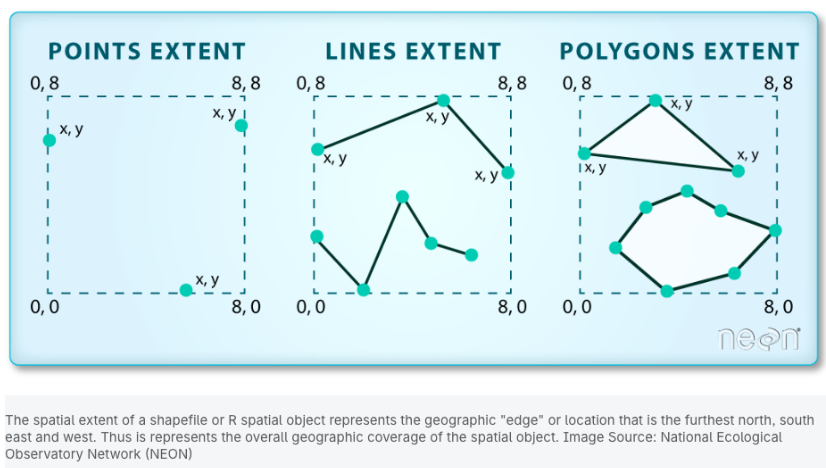

```{r klippy, echo=FALSE, include=TRUE}
klippy::klippy()
```

You can use this [template script](./mapping_script.R) file to work through the lesson. 

## Spatial Data

In this lesson, students will learn how to work with spatial data, or data with geographic information. There are different packages that in R that handle spatial data. In these packages, spatial data is stored as a special class (ex. character, number, etc.) which stores the geographic information. 

To start, let's plot North Carolina with county lines. `ggplot2` contains some mapping data that you can use without having to import from your computer. Here, we will use the function `map_data` to get the USA map data, and then filter by "north carolina" as you usually would with data frames in `dplyr`.

```{r, message = FALSE}
library(ggplot2)
library(dplyr)

map <- map_data("county")
nc <- map |>
  filter(region =="north carolina")

head(nc)
```
In this data, there are points that will be connected into polygons to plot each county based on the "group". In the aesthetics, we set x to the longitude and y to the latitude. 

```{r}
ggplot(data = nc, aes(x = long, y = lat, group = group)) +
  geom_polygon() 
```

There are different types of geographic information that we can plot. 



When plotting data as a polygon, like we are doing with the North Carolina map, points are connected with lines to make a shape. You can plot the different types of spatial data, like points, lines, and polygons, using ggplot layers. With the polygon, we will use `geom_polygon()`

You can edit the plot in the same way that you did other plots in `ggplot`. For example, now we can color each of the the counties, which are in the "subregion" column, a different color and change the theme. 

```{r}
ggplot(data = nc, aes(x = long, y = lat, group = group)) +
  geom_polygon(aes( fill = subregion))+
  theme_void()+
  theme(legend.position = 'none') 
```

With plotting spatial data, you have to consider the *coordinate* system, which determines how the spherical data from the earth is plotted flattened as a 2-D map. There are different coordinate systems that you can use. The default is cartesian coordinates, where x and y coordinates are 1:1. 

See what happens when you change the coordinate systems by adding some of the following layers:

1. `coord_map() `: Mercator projection
1. `coord_map("conic", lat0 = 30)`
1. `coord_map('gilbert')`
1.`coord_map('orthographic')`


```{r, include = F, fig.show=F}
ggplot(data = nc, aes(x = long, y = lat, group = group)) +
  geom_polygon(aes( fill = subregion))+
  theme_void()+
  theme(legend.position = 'none') +
  coord_map()
```

## Plotting polygons in sf

In the last example, we plotted a polygon simply by connecting points with lines. However, other data sources have polygon spatial data stored differently. In the next example, we will plot using a shape (.shp) file in the package `sf`. We will plot the major rivers or streams in Wake County. The file is already in your Posit Cloud workspace. To load in the shape file using `sf`, you will use the function `st_read`.

```{r}
library(sf)
rivers <- st_read('data/Major_Rivers/')
```

You can already see that this is different than a regular csv file, with information about the geographic data shown as you import the data. Specifically, you can see that the coordinates are XY, a "bounding box" or dimensions, and a coordinate system (Projected CRS). 

You can also see in the data a column for the geometry. This determines the shape of each stream. 

```{r}
head(rivers)
rivers$geometry[1]
```

You can use the functions `st_bbox` to find the boundaries of the file and `st_crs` to view the coordinate system information. 

```{r}
st_bbox(rivers)
st_crs(rivers)
```

To plot the streams, you can use the layer `geom_sf`. You do not need to specify any x and y values here as you did in the last example. Because there is already a coordinate system associated with the file, ggplot will automatically plot in the given coordinate system. 

```{r}
ggplot() +
  geom_sf(data = rivers, color = 'blue')
```

Although the data has associated geometries, you can still manipulate the data frame, for example, using `dplyr`. 

We can use `distinct` to find each stream in the data or can filter for specific streams. 

```{r}
rivers |>
  distinct(NAME)

rivers |>
  filter(NAME == 'Cemetery Branch') 
```

For fun, let's plot just Cemetery Branch over the other streams in a different color to highlight it. Here, we can also use the `theme_void` to remove gridlines and axes. 

```{r}
cemetery_branch<- rivers |>
  filter(NAME == 'Cemetery Branch')

ggplot() +
  geom_sf(data = rivers, color ='cornflowerblue') +
  geom_sf(data = cemetery_branch, color = 'red') + 
  theme_void()
```

#### Practice 

In addition, you can layer multiple shape files. In your data folder, you also have a shape file for the Wake County Line. 

Plot the Wake County line with the stream data. This file is called "Wake_County_Line-shp".

You will be able to get something that looks like this: 

```{r, echo = F, message = F, warning=FALSE, results= 'hide'}
wake <- st_read('data/Wake_County_Line-shp/')
ggplot() +
  geom_sf(data = rivers, color ='cornflowerblue') +
  geom_sf(data = cemetery_branch, color = 'red') + 
  geom_sf(data = wake, fill = 'transparent', size = 1.5) +
  theme_void()
```


## Plotting points and changing coordinate systems

It is pretty straightforward to plot points on maps since you can plot based on the x and y coordinates. You can plot points in the same way that you have done before with x and y values. With GPS coordinates, the x is longitude and the y is latitude. 

You can also use the function `st_point` in the `sf` package for geographic points. 

```{r}
park <- st_point(c(-78.625, 35.795))
```

To add the point to the plot, again use `geom_sf` since you have make stored the point as an `sf` object. 

<span style="color:blue"> *What happens when you add the point to the previous plot?* </span>

When plotting different layers, you have to make sure the coordinate systems are the same. You can see that the units for each are still not the same. 

```{r}
st_bbox(park)
st_bbox(rivers)
```

We can change the coordinate systems using `st_transform.` We will do this for each of the objects to make sure they are on the same system. Most coordinate systems have a unique EPSG number. Here, we will use [EPSG 4269](https://epsg.io/4269), which is the same North American Datum 1983 system as before, but by transforming it, it will turn units to GPS coordinates. We also have to set the crs when making the point in for the point by setting the crs with `st_stc`. 

```{r}
rivers <- st_transform(rivers, crs = 4269)
park <- st_sfc(park,crs = 4269)
```

Now, plot again. 

```{r}
ggplot() +
  geom_sf(data = rivers, color = 'blue') + 
  geom_sf(data = park, color = 'red') +
  theme_void()
```

This previous way of plotted points used a spatial data object for the points. However, it can also be done by simply using `geom_point()`. This does require again that the *units* of the axes be in GPS coordinates. 

```{r}
ggplot() +
  geom_sf(data = rivers, color = 'blue')+
  geom_point(aes(x = -78.62475, y = 35.79474), color = 'red') +
    theme_void()
```

### Working with multiple shape files

We are only scratching the surface of all you can do with spatial data. For example, you may want to work with multiple shape files or different types of spatial data. There are many functions in `sf` to work with multiple files including: 

- st_intersection
- st_join
- st_crop
- st_mask
- st_union

If we decide to work on spatial project, we can investigate these more. 

## Water Quality Data

In class, we will work on plotting the streams that we are working on for the water quality in Raleigh Project. 

When we learned about joins, we used a data file that had the Site IDs matched to a stream name. This file also has latitude and longitude coordinates for where streams were measured. 

In this part of the lesson, we will make a map showing where stream site locations. 

Import in the `stream_codes` data file into R. 

```{r}
stream_codes <- read.csv('https://maryglover.github.io/bio331/open_data/stream_codes.csv')

head(stream_codes)
```

Based on what you have learned so far, what do you think you would need to do to add the site locations to the map of streams in Wake County?

<span style="color:blue">**Let's plot this together, thinking about how to make the map visually appealing.**</span>

```{r, echo = F, message = F, fig.show='hide'}
library(ggthemes)
ggplot() +
  geom_sf(data = rivers, color = 'cornflowerblue')+
  geom_point(data = stream_codes, aes(x = long, y = lat, color = Stream ))+
 # scale_color_simpsons()+
  scale_color_tableau(palette = 'Tableau 20')+
  theme_void()

```

### Plotting data on maps

With the City of Raleigh water quality data set, choose 1 parameter to investigate. 

1. Group_by the sites and summarize the parameter to get the average across all of the years (or filter for a subset of the years). 
1. Join in the latitude and longitude data from the stream codes data with the summary table. 
1. Plot the streams from the stream shape file *and* the points for each of the stream sites. 
1. Change the color of the plot based on the parameter that you summarized. 

## New functions

*ggplot2*

- geom_polygon()
- coord_map()

*sf*

- st_read()
- st_transform()
- st_bbox()
- st_crs()
- st_sfc()
- geom_sf()


## Resources

- [Color in `ggplot`](https://ggplot2-book.org/scales-colour)
- [Shape files and vector data](https://tmieno2.github.io/R-as-GIS-for-Economists/geom-raster.html)
- [Coordinate systems](https://datacarpentry.org/organization-geospatial/03-crs.html)


### Road map layers

In the maps we have been making so far, we are simply plotting on an empty map. However, it is nice to add in some map features in the background, like roads or sateline images. To do this we can use the `ggspatial` package which has some "map tiles" loaded in. We can do this with the `annotation_map_tile` function. There are different types of tiles you can use including:

- cartolight
- osm
- opencycle
- cartodark
- loviniacycle

Here, I am plotting the Raleigh stream system, that we used before, and the 'cartolight' map. 

```{r}
library(ggspatial) 
ggplot() +
annotation_map_tile(type = 'cartolight', zoomin = -1)+
geom_sf(data = rivers, color = 'darkblue', linewidth = 1.5) +
theme_void()  
```

There are additional map layers that you can find to use as base plot, but it may take some searching to find 1) free ones and 2) how to download them. 
