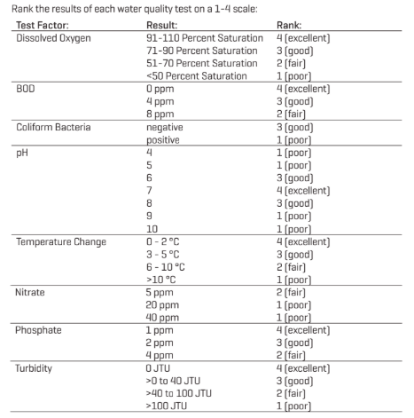

```{r klippy, echo=FALSE, include=TRUE}
klippy::klippy()
```

In this activity, we will continue to work with the water quality data, creating an overall water quality score that we can use to evaluate the different streams. 

## Water quality index 

The City of Raleigh uses the following information to evaluate water quality of streams. 



We can use this information to calculate a composite score of the water quality, by assigning a rank score for each of the factors measured and adding them together. 

First, go ahead and read in your water quality data file from where ever you have it saved. 

```{r}
wq <- read.csv('data/raleigh_water_analysis.csv')
```

We can create the composite score by utilizing the `mutate` function and `case_when`. `case_when` allows you to specify a value based on certain criteria. Therefore, we can use it to specify the rank score based on data for different parameters.

Here, I will show you how to make a new column for the dissolved oxygen rank. I will put the rank in a new column, "DO_rank"

```{r, message = F}
library(dplyr)
wq |>
  mutate(DO_rank = case_when(do_percent_sat >= 91 ~ 4, 
                             do_percent_sat < 91 & do_percent_sat >= 71 ~ 3, 
                             do_percent_sat < 71 & do_percent_sat >= 51 ~ 2, 
                             do_percent_sat < 51 ~ 1)) |>
  select(Site, Date,  do_percent_sat, DO_rank) |>
  head()
```

Here, I am just showing you the first few rows and selected columns. But you can see that now we have a new column, `DO_rank`, which corresponds to the `do_percent_sat`. When you make your new file with the ranked scores *do not* save only certain columns and rows. 

### Activity

#### Step 1

Using `mutate` and `case_when` calculate the ranks for dissolved oxygen, *E. coli*, pH, nitrogen, phosphorus, and turbidity. You may work with partners to split up code for the different parameters.   

#### Step 2

Use mutate to add together the different ranked scores for **one water quality score**.

#### Step 3

Save the file with the water quality score as a new csv file. Name the file `raleigh_water_score.csv`

## Analyzing Water Quality Score

Now that we have calculated a water quality score for each time the water was measured in a stream, we can explore this data. 

Some examples of things we can do with this score. 

- See how the water quality score changes overtime, for all of Raleigh or for the different sites. 
- Compare the water quality scores for the different sites. Which site has the highest quality?

**We will discuss as a class how we want to use this water quality score**

Based on what we discuss as a class, you will make graphs and summary tables using this data. 

### Homework 

For homework, you will submit the **Coding: Final Project Code** assignment in moodle, with all your code for the water quality analysis. 

1. **Code**. Keep a good record of the code you use to complete this activity. In your R script, take notes (using the # sign) to describe what you are doing. 
1. **A summary**: Record your observations and findings in a google document. In your gogle document, you can copy the figures you make and describe your results in each part of the activity.
1. **Code Questions**: Write down any questions that you have about the data. 
1. Submit the code and the summary file in the initial code and questions file in Moodle. 
